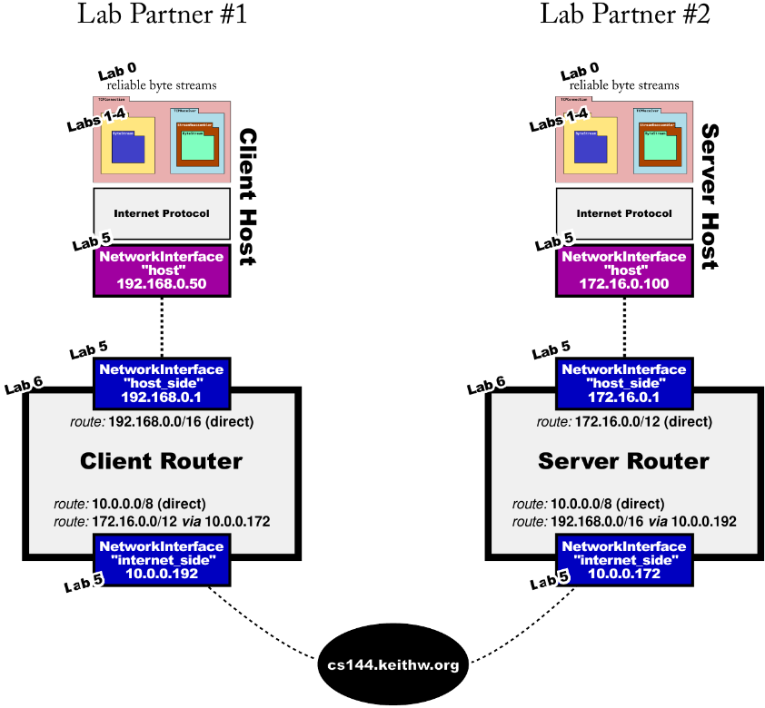
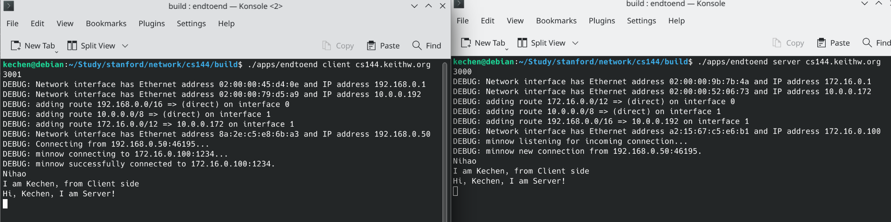

Stanford CS 144 Networking Lab
==============================

These labs are open to the public under the (friendly) request that to
preserve their value as a teaching tool, solutions not be posted
publicly by anybody.

Website: https://cs144.stanford.edu

## Features
Side project for Stanford’s CS144 (Introduction to Computer Networking): Developed a C++ implementation of the TCP/IP protocol stack.
- **Utilization of C++11 New Features**: Employed modern C++11 features to enhance code efficiency and readability. Utilized move semantics, destructors, functions and lambdas, std::optional and type safety, template classes and const correctness, and template functions.
- **Socket API Programming**: Created TCP stream sockets at the Application Layer, establishing connections with web servers and fetching pages.
- **Reliable Data Transfer**: Implemented TCP's "best effort" and robustness features against lower-layer channel unreliability. Implemented reassembly, timeout and fast retransmission mechanisms, and cumulative acknowledgment features.
- **Congestion & Flow Control**: Developed sliding window protocols and pipelines for controlling sender and receiver window sizes. Utilized a piggyback mechanism to embed window size information in acknowledgment segments. Implemented the AIMD algorithm for dynamic adjustment of sender window sizes.
- **ARP Protocol and Router Implementation**: Developed a network interface with ARP protocol to translate between the Network Layer and Link Layer. Implemented auto-learning through broadcast for mapping IPv4 addresses to MAC addresses. Implemented the longest prefix-matching algorithm for router decision-making based on the routing table.

  

## cmake commands
If you get your builds stuck and aren’t sure how to fix them, you can erase your build
directory: `rm -rf build`

To set up the build system: `cmake -S . -B build`

To compile: `cmake --build build`

To run tests: `cmake --build build --target test`

To build different checkpoints: `cmake --build build --target check0`

To run speed benchmarks: `cmake --build build --target speed`

To run clang-tidy (which suggests improvements): `cmake --build build --target tidy`

To format code: `cmake --build build --target format`

## How to use
### Server-Client Communication
- From the “build” directory, the “server” runs:  
`./apps/endtoend server cs144.keithw.org 3000`  
3000 can be replaced by a random even number between 1024 and 64000

- From the “build” directory, the “client” runs:  
`./apps/endtoend client cs144.keithw.org 3001`  
replace “3001” with whatever your random number was, plus one

### File Transmit
- To write a one-megabyte random file to “/tmp/big.txt”:  
`dd if=/dev/urandom bs=1M count=1 of=/tmp/big.txt`  

- To have the server send the file as soon as it accepts an incoming connection:  
`./apps/endtoend server cs144.keithw.org even number < /tmp/big.txt`

- To have the client close its outbound stream and download the file:  
`</dev/null ./apps/endtoend client cs144.keithw.org odd number > /tmp/big-received.txt`  

- To compare two files and make sure they’re the same:  
`sha256sum /tmp/big.txt or sha256sum /tmp/big-received.txt`

## Resource
https://drive.google.com/drive/folders/1wiXa2jHrYs1ZksWZVfr7vbjVLs4EMnnG?usp=sharing